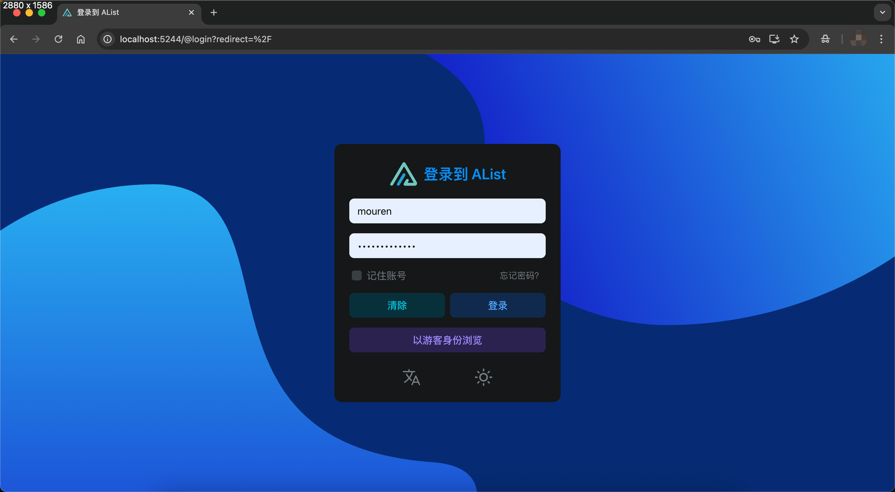

# OpenList for macOS

OpenList 是一个轻量级的服务列表管理工具，此项目是为 macOS 系统打包的桌面应用程序版本。它提供了一个 Web 控制面板，方便用户通过浏览器管理服务列表。

## 功能特性

- 🖥️ 原生 macOS 应用体验
- 🌐 Web 控制面板界面
- 🔧 服务启动/停止控制
- 🔐 管理员密码重置功能
- 📦 一键打包为 .dmg 安装包

## 项目结构

```
.
├── openlist                  # OpenList 核心可执行文件
├── openlist_launcher.sh      # 应用启动脚本
├── openlist.icns             # 应用图标
├── background.png            # DMG 安装包背景图
├── make_release.sh           # 打包发布脚本
├── release/                  # 打包输出目录
│   ├── README.md             # 发行版说明文档
│   ├── release_qr.html       # 二维码下载页面模板
│   └── ...                   # 打包生成的文件
└── OpenList.app/             # 构建后的应用包 (由脚本生成)
```

## 使用方法

### 安装

1. 从 release 页面下载最新的 `.dmg` 文件
2. 双击打开 DMG 镜像
3. 将 `OpenList.app` 拖拽到应用程序文件夹
4. 首次运行时如提示"无法验证开发者"，请右键点击应用选择"打开"

### 运行

1. 启动 OpenList 应用后会弹出控制台窗口
2. 点击"启动服务"按钮启动服务
3. 点击"访问地址"按钮在浏览器中打开 Web 管理界面
4. 默认访问地址：http://localhost:5244
5. 默认管理员账户：admin

### 管理功能

控制台提供以下功能：
- 启动/停止服务
- 重置管理员密码（支持随机生成或手动设置）
- 访问 Web 管理界面


